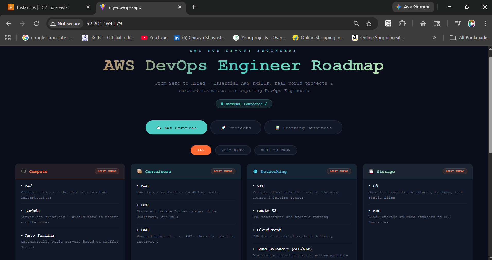

🚀 DevOps Project 1 - Monorepo

A full-stack monorepo with Backend + Frontend + CI/CD pipeline using GitHub Actions.

🌐 Live Demo

Frontend: http://52.201.169.179

Backend API: http://52.201.169.179:3000

Health Check: http://52.201.169.179:3000/health

## 🏗️ Architecture

```ascii
Developer (Local)
      │
      │ git push
      ▼
┌─────────────────────┐
│   GitHub Repository │───── Triggers ────▶ GitHub Actions (CI/CD)
└─────────────────────┘                          │
                                                 │ SSH Deploy
                                                 ▼
                                      ┌──────────────────────────────┐
                                      │        AWS EC2 (Ubuntu)      │
                                      │                              │
                                      │  ┌────────────┐              │
                                      │  │   Nginx    │◀── Port 80   │
                                      │  │(Reverse Proxy)            │
                                      │  └─────┬──────┘              │
                                      │        │                     │
                                      │  ┌─────▼──────┐              │
                                      │  │     PM2    │              │
                                      │  │ Process Mgr│              │
                                      │  └─────┬──────┘              │
                                      │        │                     │
                                      │  ┌─────▼──────┐              │
                                      │  │ Node.js +  │◀── Port 3000 │
                                      │  │  Express   │              │
                                      │  └────────────┘              │
                                      └──────────────────────────────┘
                                                 │
                                      ┌──────────────────────────────┐
                                      │       AWS Services           │
                                      │ • IAM Roles                  │
                                      │ • Security Groups            │
                                      │ • Elastic IP                 │
                                      └──────────────────────────────┘

# Project Structure
- **backend/** → Node.js/Express backend
- **frontend/** → React frontend
- **.github/workflows/** → CI/CD pipeline

#✨ Features
🔄 Automated CI/CD — Every GitHub push auto-deploys to AWS EC2 via GitHub Actions
🌐 Full Stack — React frontend + Node.js Express backend
⚡ Nginx Reverse Proxy — Serves frontend on port 80
🔁 PM2 Process Manager — Auto-restarts backend on crash or reboot
🔒 AWS IAM — Least-privilege roles and security groups
📌 Elastic IP — Static IP for consistent access
💚 Health Check Endpoint — /health API for monitoring


📁 Project Structure
devops-project1-monorepo/
├── .github/
│   └── workflows/
│       └── deploy.yml       ← GitHub Actions CI/CD
├── backend/
│   ├── app.js               ← Express API
│   ├── package.json
│   ├── appspec.yml
│   └── buildspec.yml
├── frontend/
│   ├── src/
│   │   └── App.jsx          ← React App
│   ├── package.json
│   └── vite.config.js
└── README.md


🔄 CI/CD Pipeline Flow
1. Developer pushes code to GitHub (main branch)
        ↓
2. GitHub Actions workflow triggers automatically
        ↓
3. GitHub Actions SSHs into AWS EC2
        ↓
4. Pulls latest code from GitHub
        ↓
5. Installs dependencies (npm install)
        ↓
6. Restarts backend with PM2
        ↓
7. Builds frontend (npm run build)
        ↓
8. Restarts Nginx
        ↓
9. ✅ Deployment Complete!


## 📸 Screenshots

### AWS DevOps Engineer Roadmap



### Deployment Views

.png)

.png)

